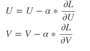

#Matrix Factorization的基本原理
Matrix Factorization的原理比较简单，就是将一个矩阵D分解为U和V的乘积，
即对于一个特定的规模为m*n的矩阵D，估计出规模分别为m*k和n*k的矩阵U和V，使得的值尽可能逼近矩阵D。
一般来讲，k的取值应该满足，这样矩阵分解才有意义。如果在推荐系统中，D代表用户对商品的行为矩阵的话，那么U和V则分别代表embedding表示的用户和商品向量。

以公式来表示的话：

其中 Ui表示U矩阵第i行的向量， Vj表示V矩阵第j行向量。
为了限制U,V的取值呈现一个以0为中心的正态分布，这里对U,V的值加上正则项，得到目标优化项。

再来求梯度。

梯度下降（梯度更新）

[参考这篇文章](https://blog.csdn.net/u014595019/article/details/80586438)